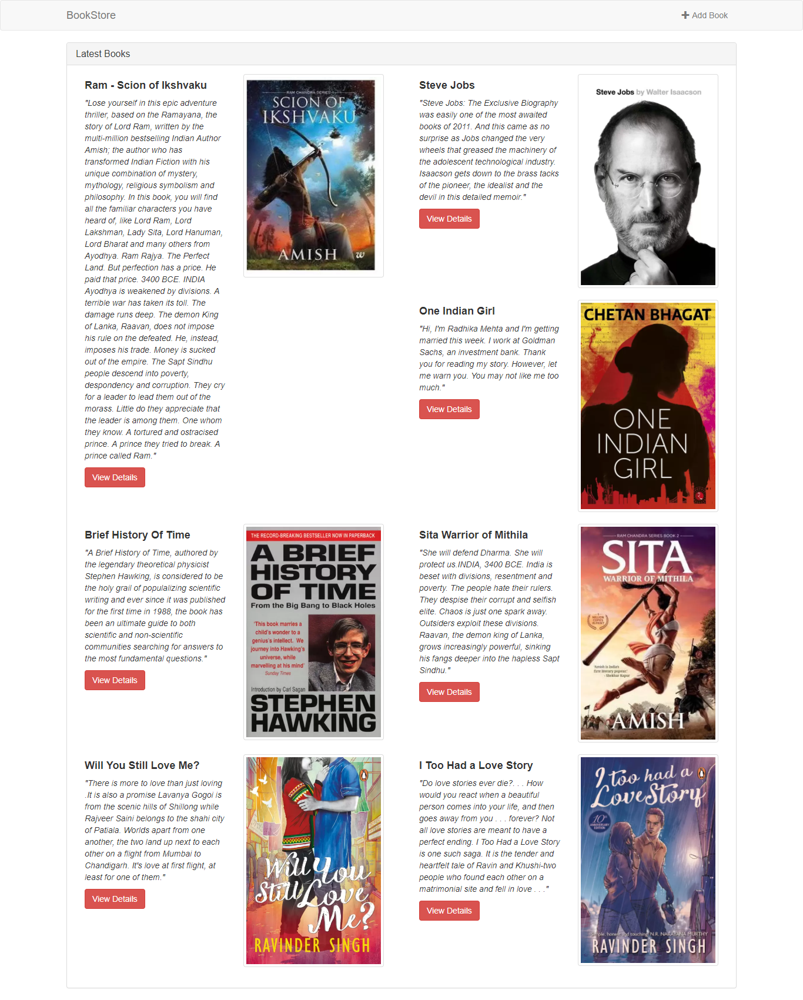

# Bookstore-RESTFUL-API
* A RESTFUL API is an application program interface (API) that uses HTTP requests to GET, PUT, POST and DELETE data.
* BookStore is a MEAN Stack Application With CURD Functions
# Sample Images

